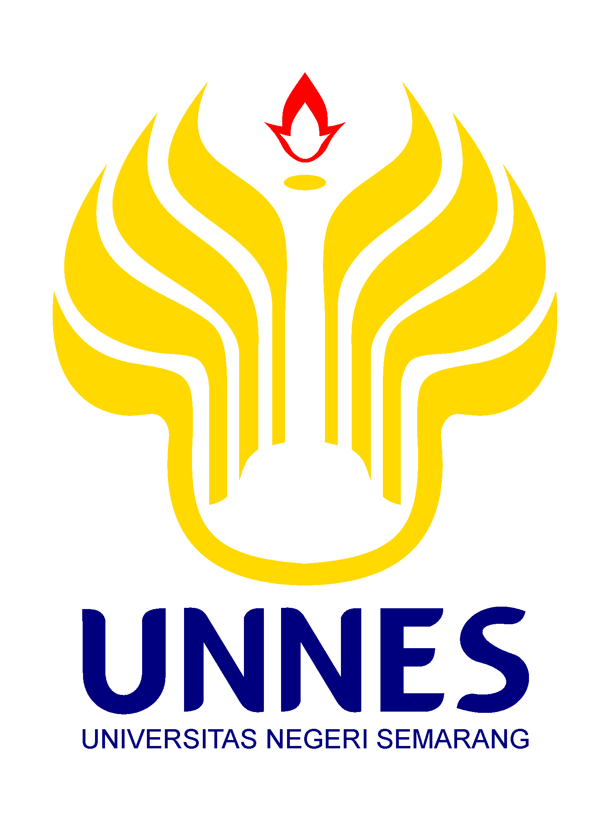
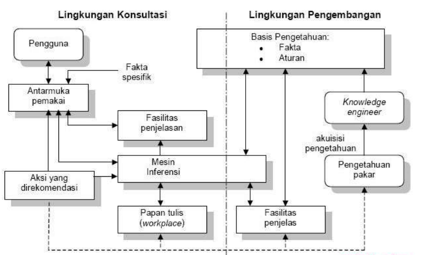
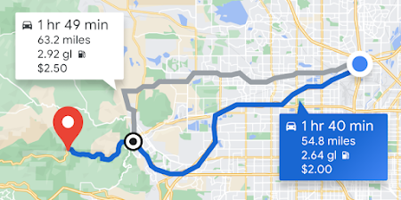

**ANALISIS SISTEM PAKAR PADA GOOGLE MAPS DAN PERENCANAAN SISTEM PAKAR
PADA IMAGE PROCESSING UNTUK QUALITY CONTROL PENGISIAN AIR MINUM DALAM
KEMASAN**

Dosen Pengampu:

Bagaskoro Saputro, S.Si., M.Cs.

{width="2.2411417322834644in"
height="2.9909656605424324in"}

Disusun Oleh :

Rasyid Muhammad Nurhakim (5311421062)

Rihandana Yudifahresi (5311421069)

Muhammad Ahnaf Maulana (5311421074)

**PRODI TEKNIK ELEKTRO**

**FAKULTAS TEKNIK**

**UNIVERSITAS NEGERI SEMARANG**

**2023**

**Expert System Pada Google Maps**

A.  **Google Maps**

> Google Maps adalah layanan peta digital yang disediakan oleh Google.
> Ini memungkinkan pengguna untuk mencari lokasi, mendapatkan petunjuk
> arah, menemukan bisnis, dan menjelajahi gambar panorama jalan (Street
> View).
>
> Google Maps menggunakan pendekatan yang bersifat heuristik dan data
> driven untuk memberikan petunjuk arah yang optimal. Meskipun Google
> Maps tidak secara eksplisit menggunakan \"sistem pakar\" konvensional
> yang terdiri dari aturan-aturan manusia, ia memanfaatkan teknik-teknik
> kecerdasan buatan, termasuk aspek-aspek dari sistem pakar, untuk
> meningkatkan pengalaman pengguna. Berikut adalah beberapa aspek yang
> dapat dianggap sebagai penerapan sistem pakar atau kecerdasan buatan
> pada Google Maps:

-   Optimasi Rute:

> Google Maps menggunakan algoritma pencarian yang canggih untuk
> menghitung rute tercepat antara dua titik berdasarkan berbagai faktor
> seperti jarak, waktu tempuh, dan kondisi lalu lintas saat ini.
> Algoritma ini dapat dianggap sebagai bentuk sistem pakar yang
> mengoptimalkan rute berdasarkan aturan dan pengetahuan terkait lalu
> lintas.

-   Estimasi Waktu Kedatangan (ETA):

> Google Maps memanfaatkan data historis dan informasi lalu lintas
> real-time untuk memberikan estimasi waktu kedatangan yang akurat.
> Sistem ini dapat dianggap sebagai sistem pakar yang memanfaatkan
> pengetahuan lalu lintas dan pola perjalanan untuk membuat prediksi
> yang lebih baik.

-   Rekomendasi Tempat:

> Google Maps memberikan rekomendasi tempat berdasarkan preferensi dan
> kebiasaan pengguna. Algoritma yang mendasari rekomendasi ini dapat
> memanfaatkan teknik machine learning untuk memahami dan memprediksi
> preferensi pengguna seiring waktu.
>
> Pada Google maps ini menggunakan sistem perantaian balik (Backward
> Chaining Systems) dimana aturan dapat digunakan untuk menarik
> kesimpulan/hasil baru dari data yang ada.

B.  **Cara Kerja**

> Penelitian (SITASI) telah membuat aplikasi semacam google yang maps
> yang menggunakan expert system dengan metode forward chaining.
> Aplikasi travel asisten ini bekerja dengan menggunakan metode forward
> chaining dalam sistem pakar. Metode ini memulai proses pencarian dari
> sekumpulan data atau fakta yang telah tersedia, kemudian mencari
> kesimpulan atau solusi dari permasalahan yang dihadapi. Proses ini
> dimulai dengan menerima data masukan dari pengguna, yang kemudian
> digunakan sebagai parameter untuk mencari data dari API pendukung
> seperti maps dan cuaca. Setelah data diperoleh secara keseluruhan,
> sistem akan melakukan identifikasi berdasarkan kriteria dan mencari
> hasil kesimpulan akhir berdasarkan aturan yang ada.
>
> Proses pencarian kesimpulan rekomendasi dalam aplikasi ini dilakukan
> dengan memasukkan semua data pada satu kesempatan, sesuai dengan cara
> pertama yang disebutkan dalam metode pencarian. Data yang digunakan
> dalam sistem pakar ini meliputi variabel-variabel seperti cuaca,
> kondisi lalu lintas, dan waktu untuk berwisata.
>
> Untuk memenuhi parameter dari aturan, sistem membutuhkan beberapa data
> dari pengguna sebagai parameter awal untuk penentuan pengambilan data
> berikutnya pada API map dan cuaca. Setelah data dan parameter telah
> lengkap, sistem akan mengeksekusi semua data yang telah siap
> menggunakan metode forward chaining. Proses ini akan menghitung data
> yang ada sehingga menghasilkan suatu keputusan berupa rekomendasi
> perjalanan yang diberikan kepada pengguna.
>
> Dalam pengimplementasian sistem inferensi menggunakan metode forward
> chaining, terdapat tahapan merancang tabel aturan (knowledge base) dan
> merancang logika serta algoritma metode forward chaining ke dalam
> aplikasi travel asisten. Proses inferensi dimulai dari sistem menerima
> data masukan dari pengguna, kemudian sistem akan menjadikan data
> tersebut sebagai parameter untuk mencari data dari API pendukung
> seperti maps dan cuaca. Setelah data diperoleh secara keseluruhan,
> sistem akan melakukan identifikasi berdasarkan kriteria dan mencari
> hasil kesimpulan akhir berdasarkan aturan yang ada.

C.  **Expert System**

Sistem pakar, atau yang sering disebut sebagai \"expert system\" dalam
bahasa Inggris, adalah jenis sistem kecerdasan buatan (AI) yang
dirancang untuk meniru dan mengeksploitasi pengetahuan dan keahlian
manusia dalam suatu bidang tertentu. Tujuan utama dari sistem pakar
adalah memberikan solusi atau membuat keputusan seperti yang akan
dilakukan oleh seorang ahli manusia dalam bidang tersebut. Sistem pakar
menggunakan pengetahuan yang diberikan oleh ahli manusia untuk membuat
aturan dan inferensi yang dapat digunakan untuk memecahkan masalah atau
memberikan saran. Ini bekerja dengan menyimpan pengetahuan ahli dalam
bentuk basis pengetahuan dan menggunakan inferensi engine untuk
menyimpulkan informasi atau membuat keputusan. Komponen utama dari
sistem pakar meliputi :

-   Basis Pengetahuan (Knowledge Base): Tempat di mana pengetahuan ahli
    > disimpan. Ini bisa berupa aturan-aturan, fakta-fakta, dan
    > informasi lainnya yang relevan dengan domain spesifik.

-   Mesin Inferensi (Inference Engine): Komponen yang bertanggung jawab
    > untuk melakukan pemrosesan logika dan menyimpulkan informasi
    > berdasarkan aturan-aturan dalam basis pengetahuan. Mesin inferensi
    > menciptakan hubungan logis antara fakta-fakta yang ada dan
    > menghasilkan output atau keputusan.

-   Antarmuka Pengguna: Komponen yang memungkinkan interaksi antara
    > pengguna dan sistem pakar. Antarmuka ini dapat berupa antarmuka
    > grafis atau antarmuka teks, tergantung pada desain sistem.

> {width="5.506767279090114in"
> height="3.3080938320209974in"}
>
> Gambar 1. Struktur Sistem Pakar
>
> Pada Google Maps, penggunaan *expert system* digunakan untuk melakukan
> *planning* atau perencanaan pada rute tercepat berdasarkan estimasi
> waktunya yang diperoleh dari *knowledge base* yang mana rute tersebut
> dapat berubah tergantung dari kondisi lalu lintas rute tersebut. Pada
> \[1\] dijelaskan penggunaan *expert system* yang sama pada Google
> Maps, dijelaskan bahwa untuk *interference engine*nya menggunakan
> *Greedy Randomised Adaptive Search Procedure* (GRASP) untuk mengolah
> data pengguna (estimasi) dan melakukan planning berdasarkan *knowledge
> base*nya.
>
> {width="4.6875in"
> height="2.3333333333333335in"}
>
> Gambar 2. Trip Estimations
>
> **Referensi**
>
> \[1\] Vansteenwegen, P., Souffriau, W., Berghe, G. vanden, &
> Oudheusden, D. van. (2011). The city trip planner: An expert system
> for tourists. *Expert Systems with Applications*, *38*(6), 6540--6546.
> [[https://doi.org/10.1016/j.eswa.2010.11.085]{.underline}](https://doi.org/10.1016/j.eswa.2010.11.085)
>
> [\[2\]Liao, S. H. (2005). Expert system methodologies and
> applications---a decade review from 1995 to 2004. *Expert systems with
> applications*, *28*(1), 93-103.]{.mark}
